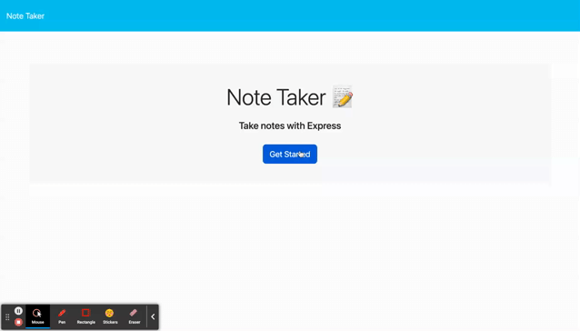

# procrastinator-assassinator 

## Description
An application that allows the user to make notes or To-do lists, and save them to refer back to. Data persists until the user chooses to delete the note.

## Installation
No installation is required, you can find the deployed page here: https://procrastinator-assassinator.herokuapp.com/ 

## Usage
1. Click on 'Get Started'
2. Then click on the 'Note Title'and type the title of your desired note
3. Then click on 'Note Text' & type a short description of your note
4. To save your note, click the 'file' icon.
5. To delete note, click the 'trash can' icon.

## Links
Repository: https://github.com/roshniipatel/procrastinator-assassinator

## Credits
Bootcamp Tutors

w3schools https://www.w3schools.com/

MDN Webdocs https://developer.mozilla.org/en-US/

## License
MIT License

